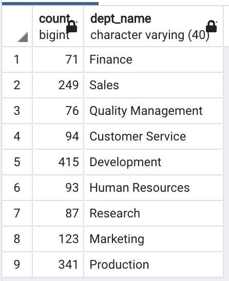
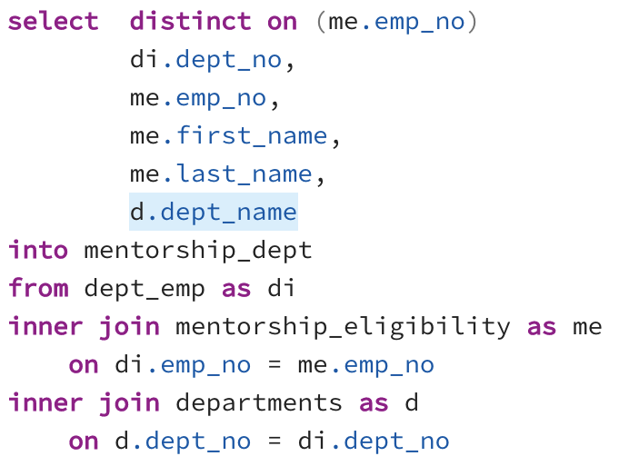

# Pewlett Hackard Analysis

## Overview of the analysis
During this analysis we will determine the number of retiring employees per title and identify employees who are eligible to participate in a mentorship program. This to assist the company Hewlet Packard with the soon to happen "silver tsunami".

## Results

- There are 1549 employees that are eligible for the mentorship program.
- The 1549 employees are all of 6 different titles: 
    - Senior Staff
    - Technique Leader
    - Staff
    - Senior Engineer
    - Engineer
    - Assistant Engineer
- The mayor impact for the company will be within the Senior Engineer employees, there are close too 26 thousand that will soon be eligible for retirement, as well as close to 25 thousand Senior Staff.
- Close to 70 thousand employees will be eligible for retirement in the next 5 years.

## Summary

How many roles will need to be filled as the "silver tsunami" begins to make an impact?
- Close to 70 thousand employees will be retiring in the next 5 years.

Are there enough qualified, retirement-ready employees in the departments to mentor the next generation of Pewlett Hackard employees?

- Yes, looking at the image below we can see that there are enough employees from each department qualified to mentor the new employees.

        
To generate the above table a new querie had to be generated. This querie shows the count of employees that are eligible for the mentorship program from each department. The initial querie to obtain this result was an update to Deliverable 2. The department name for each employee was added as seen below.

